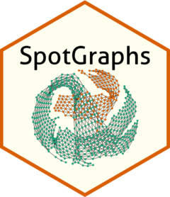

# SpotGraphs  

## Functions to aid in spatial transcriptomics data analysis

## Motivation
Current spatial transcriptomic analysis pipelines in R focus on pre-processing and visualization, while providing limited tools to interact with the "spatial" aspect of this data. To address this limitation, we provide a set of tools that allow more flexibility when working with the spatial coordinates to enable further filtering of low quality spots on tissue debris, edit spot-level adjacencies, and identify centers or boundaries of user-defined neighborhoods of interest.

This package allows users to simply provide the x,y-coordinates of their spatial data to create an igraph object with the `SpotGraph()` function, from which various graph-based statistics can be calculated and stored as meta data in the user's original Seurat or SpatialExperiment object. 

## Method overview
To construct a graph given x,y-coordinates of spatial data, the `SpotGraph()` function implements two approaches to identifying neighboring spots to build an adjacency matrix, either based on Euclidean distance or with Delaunay triangulation. See our manuscript for more details. 

## Installation
To install the latest version of our package, run:

`devtools::install_github("Sanin-Lab/SpotGraphs")`

## Usage
To create an igraph object from spatial data, the only required input into the `SpotGraph()` function is a data frame or matrix with two columns corresponding to x,y-coordinates. 

`ig = SpotGraph(coord.df)`

From the igraph object, we can now apply igraph functions, which can either be stored in the same igraph object, or stored as additional meta data columns. For example, one could calculate the number of connections (i.e., adjacent spots) per spot:

`V(ig)$degree = igraph::degree(ig)`

Or perform clustering, given spot-level adjacencies:

`cl = igraph::cluster_fast_greedy(ig)`

Which can be stored back into the original coordinates data frame:

`coord.df$igraph_clusters = factor(cl$membership)`

## Tutorials and Applications
See documentation website for in-depth walkthroughs.
