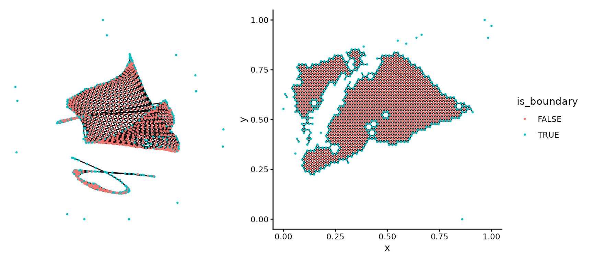
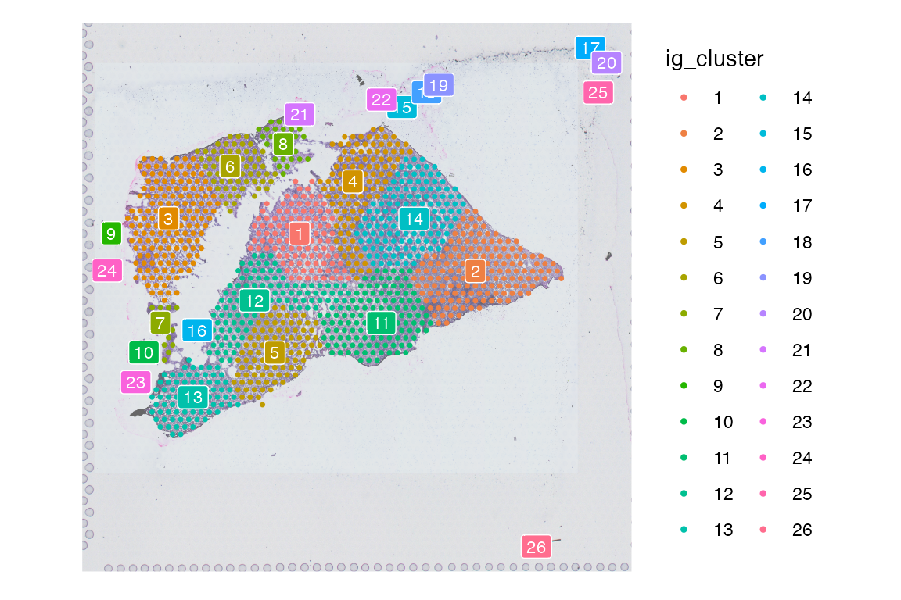
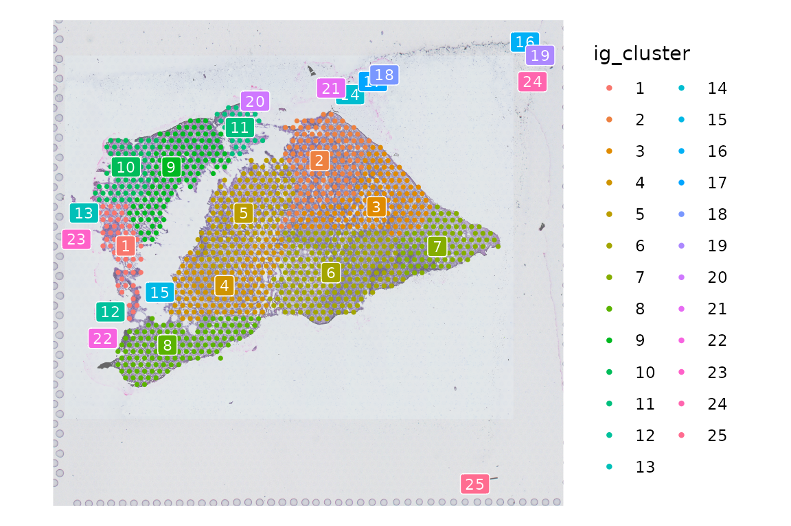
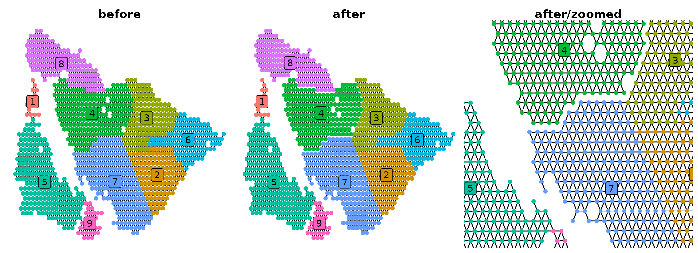

# SpotGraphs

``` r
library(SpotGraphs)
library(Seurat)
library(dplyr)
library(ggplot2)
library(patchwork)
library(viridis)
library(ggnetwork)
```

## Load example dataset

To demonstrate the general usage of SpotGraph, will use a 10X Visium
dataset from a squamous cell carcinoma patient, downloaded from
GSE208253. The raw data from GEO is provided as a Seurat object in this
package to use as an example.

``` r
scc_s1 = Seurat::UpdateSeuratObject(scc_s1)
#> Validating object structure
#> Updating object slots
#> Ensuring keys are in the proper structure
#> Ensuring keys are in the proper structure
#> Ensuring feature names don't have underscores or pipes
#> Updating slots in Spatial
#> Updating slots in slice1
#> Warning: Not validating Centroids objects
#> Updated Centroids object 'centroids' in FOV 'slice1'
#> Updated boundaries in FOV 'slice1'
#> Validating object structure for Assay5 'Spatial'
#> Validating object structure for VisiumV2 'slice1'
#> Object representation is consistent with the most current Seurat version
class(scc_s1)
#> [1] "Seurat"
#> attr(,"package")
#> [1] "SeuratObject"
dim(scc_s1)
#> [1] 36601  1185
```

## Create an igraph object

Our goal with this package is support Visium analysis by providing a
function that constructs an igraph object based on the number of
immediately adjacent spots on a slide. This opens up the analysis
pipeline to various igraph functions to perform certain tasks such as:

1.  identifying spots lying on tissue debris to be removed from
    downstream analysis
2.  distance calculations between spots by measuring the shortest path
    through the network between each spot
3.  easily identifying edges of pre-defined regions of tissue

To construct an igraph object, all we need are the x,y coordinates of
the spots on our slide.

``` r
coord = GetTissueCoordinates(scc_s1)
coord = coord[,c('x', 'y')]
head(coord)
#>                        x     y
#> AAACACCAATAACTGC-1  4809 16571
#> AAACAGGGTCTATATT-1  3944 13546
#> AAACCGTTCGTCCAGG-1  8142 14812
#> AAACGAGACGGTTGAT-1 13505 10536
#> AAACTGCTGGCTCCAA-1 11764 13053
#> AAAGACTGGGCGCTTT-1  4240  9011

ig = SpotGraph(coord = coord)
ig
#> IGRAPH e13e8a3 UN-- 1185 3189 -- 
#> + attr: name (v/c), coord_x (v/n), coord_y (v/n), is_boundary (v/l)
#> + edges from e13e8a3 (vertex names):
#>  [1] AAACACCAATAACTGC-1--AGGCGGTTTGTCCCGC-1
#>  [2] AAACACCAATAACTGC-1--CTCGTCGAGGGCTCAT-1
#>  [3] AAACACCAATAACTGC-1--GAAACATAGGAAACAG-1
#>  [4] AAACACCAATAACTGC-1--GGAACCTTGACTCTGC-1
#>  [5] AAACACCAATAACTGC-1--TCCCTGGCGTATTAAC-1
#>  [6] AAACACCAATAACTGC-1--TGGACGCAATCCAGCC-1
#>  [7] AAACAGGGTCTATATT-1--ACAGTAATACAACTTG-1
#>  [8] AAACAGGGTCTATATT-1--TTCCCGGCGCCAATAG-1
#> + ... omitted several edges
```

We can plot this igraph object with the ggnetwork package, which
interfaces directly with ggplot2, or use the SpatialPlotGraph function
provided in this package to visualize the edges drawn between each node
in the original x,y coordinates stored in the igraph object. Note that
the `is_boundary` attribute is automatically calculated from running
[`SpotGraph()`](https://sanin-lab.github.io/SpotGraphs/reference/SpotGraph.md),
which we will use to color each node in our plots.

``` r
plt.ggnet = ggplot(ig, aes(x=x, y=y, xend=xend, yend=yend)) +
  geom_edges() + 
  geom_nodes(aes(color = is_boundary), size = 0.5) +
  theme_void() +
  theme(legend.position = 'none')

plt.spg = SpatialPlotGraph(igraph_object = ig, 
                           group.by = 'is_boundary', 
                           flip.axes = T, 
                           pt.size = 0.5)

patchwork::wrap_plots(plt.ggnet, plt.spg)
```



## Spot filtering

One of the main features of the SpotGraph package is to identify spots
on a slide that lie on top of tissue debris disconnected from the rest
of the tissue sample. These are uninformative and are a technical
artifacts from sample processing, so we’d like to exclude these from our
downstream analysis. We can identify whether a spot is surrounded by
other spots using the
[`igraph::degree()`](https://r.igraph.org/reference/degree.html)
function, and filter out spots that are by themselves or only adjacent
to one other spot with
[`igraph::subgraph()`](https://r.igraph.org/reference/subgraph.html):

1.  First, extract the x,y coordinates of each spot in our dataset
2.  Create and igraph object with
    [`SpotGraph()`](https://sanin-lab.github.io/SpotGraphs/reference/SpotGraph.md)
3.  Calculate the number of connections per-spot with
    [`igraph::degree()`](https://r.igraph.org/reference/degree.html)

``` r
coord = GetTissueCoordinates(scc_s1)
coord = coord[,c('x', 'y')]

ig = SpotGraph(coord)

n_connections = igraph::degree(ig)
```

We can now plot the number of connections (i.e., the results of
[`igraph::degree()`](https://r.igraph.org/reference/degree.html)) by
storing these results back into the original Seurat object that we
started with. Additionally, we can add another metadata column to
indicate whether each spot is adjacent to more than one other spot.

``` r
scc_s1 = AddMetaData(scc_s1, n_connections, 'degree')
scc_s1 = AddMetaData(scc_s1, n_connections>1, 'adj_threshold')
```

We can now observe the results of
[`igraph::degree()`](https://r.igraph.org/reference/degree.html) with
[`Seurat::SpatialFeaturePlot()`](https://satijalab.org/seurat/reference/SpatialPlot.html).
Spots colored in red are the spots that we’ve identified to only have
one adjacent spot or are by themselves on our slide. With this method,
we would be able to further remove low quality spots from our data,
entirely based on spot-level adjacencies.

``` r
plt.deg = SpatialFeaturePlot(scc_s1, feature = 'degree', image.alpha = 0.6) +
  scale_fill_distiller(palette = 'Blues')
plt.degfilter = SpatialDimPlot(scc_s1, group.by = 'adj_threshold', image.alpha = 0.6) +
  scale_fill_manual(values = c('red', 'grey90'))
wrap_plots(plt.deg, plt.degfilter)
```



Alternatively, we could perform clustering using the spot adjacencies we
identified with
[`SpotGraph()`](https://sanin-lab.github.io/SpotGraphs/reference/SpotGraph.md).
We set the `resolution = 0` to group all spots together that are
connected in any way. We can store these clustering results back into
our Seurat object and again, plot with
[`Seurat::SpatialDimPlot()`](https://satijalab.org/seurat/reference/SpatialPlot.html).
After clustering, we can choose to keep only clusters 1 and 2, which
will let us remove any low quality spots that are disconnected from most
of the tissue sample in our data.

``` r
cl = igraph::cluster_louvain(ig, resolution = 0)
scc_s1 = AddMetaData(scc_s1, factor(cl$membership), 'igraph_clusters')
plt.cl = SpatialDimPlot(
  object = scc_s1, 
  group.by = 'igraph_clusters', 
  image.alpha = 0.6, 
  label = T, 
  label.size = 3
) + NoLegend()
  

scc_s1 = AddMetaData(scc_s1, cl$membership %in% c('1','2'), 'cl_threshold')
plt.clfitler = SpatialDimPlot(
  object = scc_s1, 
  group.by = 'cl_threshold', 
  image.alpha = 0.6
) + scale_fill_manual(values = c('red', 'grey90'))

wrap_plots(plt.cl, plt.clfitler)
```



We will apply the filter determined from using the igraph clustering
method.

``` r
# Apply filter to keep igraph clusters 1 and 2
scc_s1 = subset(scc_s1, subset = cl_threshold)
```

## CutEdges

When working with an igraph object, it may be desirable to remove all
edges between two groups of spots.

``` r
# Create igraph object
coord = GetTissueCoordinates(scc_s1)
coord = coord[,c('x', 'y')]
ig = SpotGraph(coord)

# Clustering with igraph
igraph::V(ig)$clusters = factor(igraph::cluster_fast_greedy(ig)$membership)
plt1 = SpatialPlotGraph(ig, group.by = 'clusters', label = T) +
  ggtitle('before') +
  theme_void() +
  theme(plot.title = element_text(hjust = 0.5, face = 'bold'),
        legend.position = 'none')

# Remove edges between pairs of clusters
ig = CutEdges(ig, cluster_pairs = list(c(4,7), c(4,3), c(4,8)), cluster.col = 'clusters')
plt2 = SpatialPlotGraph(ig, group.by = 'clusters', label = T) +
  ggtitle('after') +
  theme_void() +
  theme(plot.title = element_text(hjust = 0.5, face = 'bold'),
        legend.position = 'none')

plt3 = plt2 + 
  coord_cartesian(xlim = c(0.15,0.65), ylim = c(0.15, 0.65)) +
  ggtitle('after/zoomed')
wrap_plots(plt1, plt2, plt3)
```


