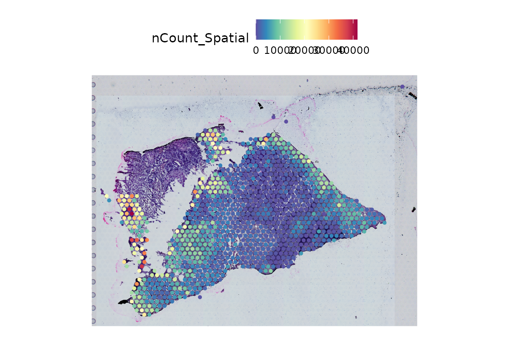

# SpotGraphs

``` r
library(SpotGraphs)
library(dplyr)
library(ggplot2)
library(viridis)
library(ggnetwork)
```

## Load example dataset

To demonstrate the general usage of SpotGraph, will use a 10X Visium
dataset from a squamous cell carcinoma patient, downloaded from
GSE208253. The raw data from GEO is provided as a Seurat object in this
package to use as an example.

``` r
scc_s1 = Seurat::UpdateSeuratObject(scc_s1)
#> Validating object structure
#> Updating object slots
#> Ensuring keys are in the proper structure
#> Ensuring keys are in the proper structure
#> Ensuring feature names don't have underscores or pipes
#> Updating slots in Spatial
#> Updating slots in slice1
#> Warning: Not validating Centroids objects
#> Updated Centroids object 'centroids' in FOV 'slice1'
#> Updated boundaries in FOV 'slice1'
#> Validating object structure for Assay5 'Spatial'
#> Validating object structure for VisiumV2 'slice1'
#> Object representation is consistent with the most current Seurat version
class(scc_s1)
#> [1] "Seurat"
#> attr(,"package")
#> [1] "SeuratObject"
dim(scc_s1)
#> [1] 36601  1185
```

## Create an igraph object

Our goal with this package is support Visium analysis by providing a
function that constructs an igraph object based on the number of
immediately adjacent spots on a slide. This opens up the analysis
pipeline to various igraph functions to perform certain tasks such as:

1.  identifying spots lying on tissue debris to be removed from
    downstream analysis
2.  distance calculations between spots by measuring the shortest path
    through the network between each spot
3.  easily identifying edges of pre-defined regions of tissue

To construct an igraph object, all we need are the x,y coordinates of
the spots on our slide.

``` r
coord = Seurat::GetTissueCoordinates(scc_s1)
coord = coord[,c('x', 'y')]
head(coord)
#>                        x     y
#> AAACACCAATAACTGC-1  4809 16571
#> AAACAGGGTCTATATT-1  3944 13546
#> AAACCGTTCGTCCAGG-1  8142 14812
#> AAACGAGACGGTTGAT-1 13505 10536
#> AAACTGCTGGCTCCAA-1 11764 13053
#> AAAGACTGGGCGCTTT-1  4240  9011

ig = SpotGraph(coord = coord)
ig
#> IGRAPH a774ec7 UN-- 1185 3189 -- 
#> + attr: name (v/c), coord_x (v/n), coord_y (v/n), is_boundary (v/l)
#> + edges from a774ec7 (vertex names):
#>  [1] AAACACCAATAACTGC-1--AGGCGGTTTGTCCCGC-1
#>  [2] AAACACCAATAACTGC-1--CTCGTCGAGGGCTCAT-1
#>  [3] AAACACCAATAACTGC-1--GAAACATAGGAAACAG-1
#>  [4] AAACACCAATAACTGC-1--GGAACCTTGACTCTGC-1
#>  [5] AAACACCAATAACTGC-1--TCCCTGGCGTATTAAC-1
#>  [6] AAACACCAATAACTGC-1--TGGACGCAATCCAGCC-1
#>  [7] AAACAGGGTCTATATT-1--ACAGTAATACAACTTG-1
#>  [8] AAACAGGGTCTATATT-1--TTCCCGGCGCCAATAG-1
#> + ... omitted several edges
```

We can plot this igraph object with the ggnetwork package, which
interfaces directly with ggplot2, or use the SpatialPlotGraph function
provided in this package to visualize the edges drawn between each node
in the original x,y coordinates stored in the igraph object. Note that
the `is_boundary` attribute is automatically calculated from running
[`SpotGraph()`](https://sanin-lab.github.io/SpotGraphs/reference/SpotGraph.md),
which we will use to color each node in our plots.

``` r
plt.ggnet = ggplot(ig, aes(x=x, y=y, xend=xend, yend=yend)) +
  geom_edges() + 
  geom_nodes(aes(color = is_boundary), size = 0.5) +
  theme_void() +
  theme(legend.position = 'none')

plt.spg = SpatialPlotGraph(igraph_object = ig, 
                           group.by = 'is_boundary', 
                           flip.axes = T, 
                           pt.size = 0.5)

patchwork::wrap_plots(plt.ggnet, plt.spg)
```


## Spot filtering

One of the main features of the SpotGraph package is to identify spots
on a slide that lie on top of tissue debris disconnected from the rest
of the tissue sample. These are uninformative and are a technical
artifact from sample processing, so we’d like to exclude these from our
downstream analysis. The
[`CleanSlide()`](https://sanin-lab.github.io/SpotGraphs/reference/CleanSlide.md)
function provides a simple way to automatically identify these spots,
based on connectivity to other spots and the number of transcripts
detected within each community of spots.

First, we extract the two inputs required for the
[`CleanSlide()`](https://sanin-lab.github.io/SpotGraphs/reference/CleanSlide.md)
function:

1.  the x,y coordinates of each spot in our dataset
2.  a vector of transcript counts detected in each spot

``` r
coord = Seurat::GetTissueCoordinates(scc_s1)
coord = coord[,c('x', 'y')]
nCounts = scc_s1$nCount_Spatial
```

The output of
[`CleanSlide()`](https://sanin-lab.github.io/SpotGraphs/reference/CleanSlide.md)
is a data.frame with the same number of rows as the input coordinate
data.frame or matrix that can be directly used with
[`Seurat::AddMetaData()`](https://satijalab.github.io/seurat-object/reference/AddMetaData.html)
to re-insert back into the original Seurat object.

``` r
res = CleanSlide(coord, nCount = nCounts)
scc_s1 = Seurat::AddMetaData(scc_s1, res)
```

We can now observe the results of
[`CleanSlide()`](https://sanin-lab.github.io/SpotGraphs/reference/CleanSlide.md)
with
[`Seurat::SpatialDimPlot()`](https://satijalab.org/seurat/reference/SpatialPlot.html)

``` r
Seurat::SpatialDimPlot(scc_s1, group.by = 'threshold', image.alpha = 0.6)
```


We can agree with these results and directly apply the threshold to
filter out these spots with `subset(scc_s1, threshold)`, or we can
manually identify groups of spots that we want to filter out. The
‘ig_cluster’ metadata column stores communities of spots, where each
spot is immediately adjacent to other spots.

``` r
Seurat::SpatialDimPlot(scc_s1, group.by = 'ig_cluster', image.alpha = 0.6, label = T, label.size = 3)
```


In this case, we could manually remove clusters 9, 10, 23, 24, 26, 22,
15, 18, 19, 17, 20, and 25.

``` r
spot_clusters_to_remove = c(9, 10, 23, 24, 26, 22, 15, 18, 19, 17, 20, 25)
scc_s1 = scc_s1[, !scc_s1$ig_cluster %in% spot_clusters_to_remove]
Seurat::SpatialFeaturePlot(scc_s1, features = 'nCount_Spatial', pt.size.factor = 2)
```



## CutEdges

When working with an igraph object, it may be desirable to remove all
edges between two groups of spots.

``` r
# Create igraph object
coord = Seurat::GetTissueCoordinates(scc_s1)
coord = coord[,c('x', 'y')]
ig = SpotGraph(coord)

# Clustering with igraph
igraph::V(ig)$clusters = factor(igraph::cluster_fast_greedy(ig)$membership)
plt1 = SpatialPlotGraph(ig, group.by = 'clusters', label = T) +
  ggtitle('before') +
  theme_void() +
  theme(plot.title = element_text(hjust = 0.5, face = 'bold'),
        legend.position = 'none')

# Remove edges between pairs of clusters
ig = CutEdges(ig, cluster_pairs = list(c(2,1), c(2,10)), cluster.col = 'clusters')
plt2 = SpatialPlotGraph(ig, group.by = 'clusters', label = T) +
  ggtitle('after') +
  theme_void() +
  theme(plot.title = element_text(hjust = 0.5, face = 'bold'),
        legend.position = 'none')

plt3 = plt2 + 
  coord_cartesian(xlim = c(0.35,0.8), ylim = c(0.4, 1)) +
  ggtitle('after/zoomed')
patchwork::wrap_plots(plt1, plt2, plt3)
```


