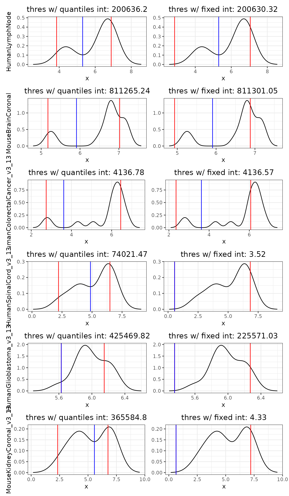
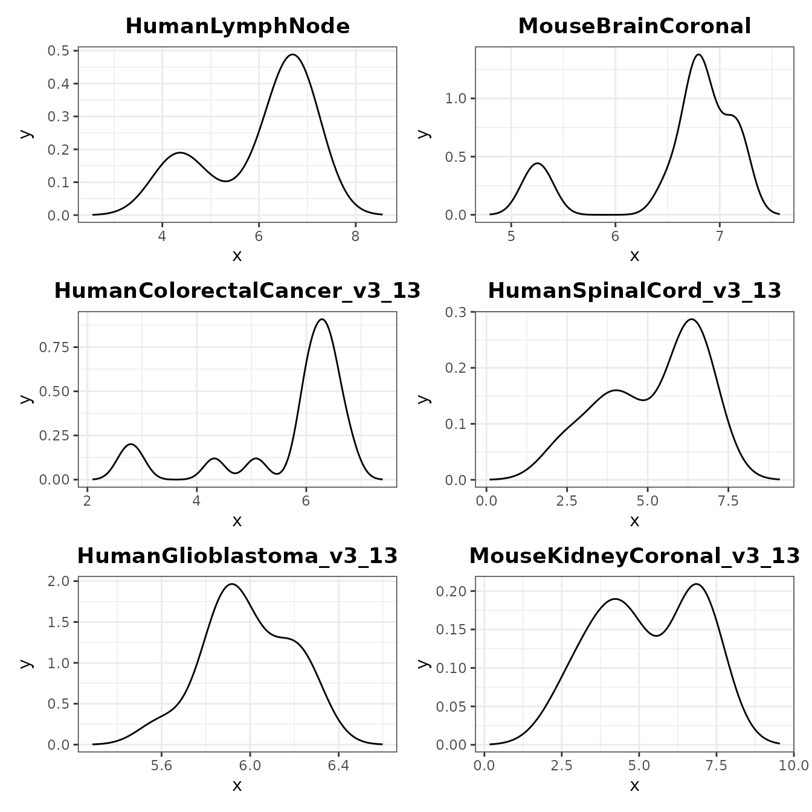
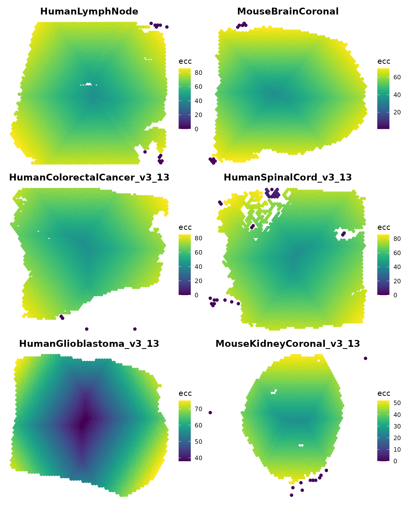

# ThresholdTests

## Test different strategies to automatically detect a threshold for filtering

``` r
library(SpotGraphs)
library(dplyr)
library(stringr)
library(tidyr)
library(ggplot2)
library(viridis)
library(patchwork)
```

### Load several datasets to get a survey of potential cluster_nCount distributions

``` r
# retrieve data from TENxVisium
eh = ExperimentHub::ExperimentHub()
q = AnnotationHub::query(eh, 'TENxVisium')
ds.names = c('HumanLymphNode', 
             'MouseBrainCoronal',
             'HumanColorectalCancer_v3.13',
             'HumanSpinalCord_v3.13',
             'HumanGlioblastoma_v3.13',
             'MouseKidneyCoronal_v3.13')
id = q$ah_id[q$title %in% ds.names]
spe.ls = lapply(id, function(ds.id) eh[[ds.id]])
names(spe.ls) = ds.names %>% str_replace('\\.', '_')
```

### Use CleanSlide to get cluster_nCounts

``` r
spe.ls = lapply(spe.ls, function(spe) {
  colData(spe)$nCount = colSums(assay(spe))
  return(spe)
})
res.ls = lapply(spe.ls, function(spe) {
  coord = SpatialExperiment::spatialCoords(spe) %>% as.data.frame()
  colnames(coord) = c('x', 'y')
  CleanSlide(coord = coord, nCount = spe$nCount)
})
```

### Store the result dataframe in each SpatialExperiment object

``` r
for (ds.name in names(res.ls)) {
  colData(spe.ls[[ds.name]]) = cbind(colData(spe.ls[[ds.name]]), res.ls[[ds.name]])
}
```

### Define a function to plot nCounts on tissue image

``` r
ImageFeature = function(obj, feature = 'nCount', label = F) {
  # First, scale the x,y coordinates to fit the low-res H&E image
  lowres_scale <- imgData(obj)[imgData(obj)$image_id == 'lowres', 'scaleFactor']
  coord.xy = SpatialExperiment::spatialCoords(obj) %>% as.data.frame()
  coord.xy$x_axis <- coord.xy$pxl_row_in_fullres * lowres_scale
  coord.xy$y_axis <- coord.xy$pxl_col_in_fullres * lowres_scale
    
  # Flip the y-axis
  coord.xy$y_axis <- abs(coord.xy$y_axis - (ncol(imgRaster(obj)) + 1))
    
  # Get metadata feature from object
  coord.xy[,feature] = colData(obj)[,feature]

  # Create plot of transcripts per spot overlaid ontop of H&E
  plt = ggplot(mapping = aes(1:600, 1:600)) +
    annotation_raster(imgRaster(obj), 
                      xmin = 1, xmax = 600, 
                      ymin = 1, ymax = 600) +
    geom_point(data=coord.xy, alpha=0.5, size = 0.5,
               aes_string(x='x_axis', y='y_axis', color=feature)) +
    scale_color_viridis(option = 'turbo', name = feature) +
    coord_cartesian(xlim = c(1,600), 
                    ylim = c(1,600)) +
    coord_fixed() +
    theme_void()
  
  if (label) {
    df.labels = coord.xy %>% 
      reframe(.by = all_of(feature), 
              x_axis = mean(x_axis),
              y_axis = mean(y_axis))
    
    plt = plt +
      geom_label(data = df.labels, 
                 size = 3,
                 aes_string(x='x_axis',
                            y='y_axis', 
                            label = feature, 
                            color=feature))
  }
  return(plt)
}
```

### Plot spotgraph cluster nCounts on tissue images

``` r
plt.ncount = lapply(names(spe.ls), function(ds.name) {
  ImageFeature(spe.ls[[ds.name]], feature = 'cluster_nCount', label = T) +
    ggtitle(ds.name) +
    theme(plot.title = element_text(hjust = 0.5, face = 'bold'),
          legend.position = 'none',
          plot.margin = margin(rep(0.75,4),'cm'))
})

wrap_plots(plt.ncount, ncol = 2)
```


### Calculate intervals with various strategies

``` r
# get count densities of each slide
den.ls = lapply(res.ls, function(res) {
  nCount = unique(res$cluster_nCount)
  den = density(log10(nCount))
  return(den)
})

# calculate different thresholds for each slide
plt.tests = list()
thres.perc.ls = list()
thres.fixed.ls = list()

for (ds.name in names(den.ls)) {
  den = den.ls[[ds.name]]
  
  # quantile window
  int.perc = c(spatstat.univar::quantile.density(den, 0.05), 
               spatstat.univar::quantile.density(den, 0.75))
  thres.perc.ls[[ds.name]] = approxfun(den$x, den$y) %>% optimise(interval=int.perc)
  thres.perc.ls[[ds.name]] = 10^(thres.perc.ls[[ds.name]]$minimum)
  
  # fixed window
  int.fixed = c(quantile(den$x, 0.05), quantile(den$x, 0.75))
  thres.fixed.ls[[ds.name]] = approxfun(den$x, den$y) %>% optimise(interval=int.fixed)
  thres.fixed.ls[[ds.name]] = 10^(thres.fixed.ls[[ds.name]]$minimum)
  
  # create data frame for plotting
  df = data.frame(x = den$x, y = den$y)
  
  # create plots
  plt.base = ggplot(df, aes(x = x, y = y)) +
    geom_line() +
    theme_bw() +
    theme(plot.title = element_text(hjust = 0.5))
  
  plt.perc = plt.base + 
    geom_vline(xintercept = int.perc, color = 'red') +
    geom_vline(xintercept = log10(thres.perc.ls[[ds.name]]), color = 'blue') +
    ylab(ds.name) +
    ggtitle(
      label = paste('thres w/ quantiles int:', 
                    round(thres.perc.ls[[ds.name]], 0))
      )
  plt.fixed = plt.base + 
    geom_vline(xintercept = int.fixed, color = 'red') +
    geom_vline(xintercept = log10(thres.fixed.ls[[ds.name]]), color = 'blue') +
    ggtitle(
      label = paste('thres w/ fixed int:', 
                    round(thres.fixed.ls[[ds.name]], 0))
      ) +
    theme(axis.title.y = element_blank())
  
  plt.tests[[ds.name]] = wrap_plots(plt.perc, plt.fixed)
  
  # clean up variables that change every loop
  rm(den, int.perc, int.fixed, df, plt.base, plt.perc, plt.fixed)
}

wrap_plots(plt.tests, ncol = 1)
```



### Plot which spots would be filtered out with each threshold

``` r
# add thresholds to each SpatialExperiment object
for (ds.name in names(spe.ls)) {
  thres.perc = spe.ls[[ds.name]]$cluster_nCount > thres.perc.ls[[ds.name]]
  thres.fixed = spe.ls[[ds.name]]$cluster_nCount > thres.fixed.ls[[ds.name]]
  spe.ls[[ds.name]]$threshold.perc = thres.perc %>% 
    ifelse('pass', 'nopass') %>% 
    factor(levels = c('nopass', 'pass'))
  spe.ls[[ds.name]]$threshold.fixed = thres.fixed %>% 
    ifelse('pass', 'nopass') %>% 
    factor(levels = c('nopass', 'pass'))
  rm(thres.perc, thres.fixed)
}

# create plots
plt.thresholds = lapply(names(spe.ls), function(ds.name) {
  plt1 = ImageFeature(spe.ls[[ds.name]], feature = 'threshold.perc', label = F) +
    scale_color_manual(values = c('red', 'grey'), drop = F) +
    ggtitle(ds.name, subtitle = 'percentiles') +
    theme(plot.title = element_text(hjust = 0.5, face = 'bold'),
          plot.subtitle = element_text(hjust = 0.5),
          legend.position = 'none', 
          plot.margin = margin(rep(0.75,4),'cm'))
  plt2 = ImageFeature(spe.ls[[ds.name]], feature = 'threshold.fixed', label = F) +
    scale_color_manual(values = c('red', 'grey'), drop = F) +
    ggtitle(ds.name, subtitle = 'fixed window') +
    theme(plot.title = element_text(hjust = 0.5, face = 'bold'),
          plot.subtitle = element_text(hjust = 0.5),
          legend.position = 'none', 
          plot.margin = margin(rep(0.75,4),'cm'))
  return(wrap_plots(plt1, plt2, ncol = 2))
})

wrap_plots(plt.thresholds, ncol = 1)
```



### Use eccentricity to determine which spots should be filtered out

eccentricity = the max distance between one spot and all other spots

``` r
# Create igraph objects for each SPE object
ig.ls = lapply(spe.ls, function(spe) {
  coord = SpatialExperiment::spatialCoords(spe) %>% as.data.frame()
  colnames(coord) = c('x', 'y')
  SpotGraph(coord = coord)
})

# Calculate eccentricity of all points on each slide
for (id in names(ig.ls)) {
  igraph::V(ig.ls[[id]])$ecc = igraph::eccentricity(ig.ls[[id]], weights = NA)
}

# Plot eccentricity
plt.ecc = lapply(names(ig.ls), function(id) {
  SpatialPlotGraph(ig.ls[[id]], group.by = 'ecc') +
    scale_color_viridis() +
    ggtitle(id) +
    guides(alpha = guide_none(),
           color = guide_colorbar(title = 'ecc')) +
    theme_void() +
    theme(plot.title = element_text(hjust = 0.5, face = 'bold'))
})
wrap_plots(plt.ecc, ncol = 2)
```



``` r
plt.eccthres = lapply(names(ig.ls), function(id) {
  ig = ig.ls[[id]]
  thres = 5
  igraph::V(ig)$ecc_thres = ifelse(igraph::V(ig)$ecc > thres, 'pass', 'nopass') %>% 
    factor(levels = c('nopass', 'pass'))
  
  spe = spe.ls[[id]]
  spe$ecc_thres = igraph::V(ig)$ecc_thres
  
  ImageFeature(spe, feature = 'ecc_thres') +
    scale_color_manual(values = c('red', 'grey'), drop = F) +
    ggtitle(id) +
    theme(plot.title = element_text(hjust = 0.5, face = 'bold'),
          legend.position = 'none', 
          plot.margin = margin(rep(0.75,4),'cm'))
})
#> Warning: In `margin()`, the argument `t` should have length 1, not length 4.
#> ℹ Argument get(s) truncated to length 1.
#> Warning in unit(c(t, r, b, l), unit): NAs introduced by coercion
#> Warning: In `margin()`, the argument `t` should have length 1, not length 4.
#> ℹ Argument get(s) truncated to length 1.
#> Warning in unit(c(t, r, b, l), unit): NAs introduced by coercion
#> Warning: In `margin()`, the argument `t` should have length 1, not length 4.
#> ℹ Argument get(s) truncated to length 1.
#> Warning in unit(c(t, r, b, l), unit): NAs introduced by coercion
#> Warning: In `margin()`, the argument `t` should have length 1, not length 4.
#> ℹ Argument get(s) truncated to length 1.
#> Warning in unit(c(t, r, b, l), unit): NAs introduced by coercion
#> Warning: In `margin()`, the argument `t` should have length 1, not length 4.
#> ℹ Argument get(s) truncated to length 1.
#> Warning in unit(c(t, r, b, l), unit): NAs introduced by coercion
#> Warning: In `margin()`, the argument `t` should have length 1, not length 4.
#> ℹ Argument get(s) truncated to length 1.
#> Warning in unit(c(t, r, b, l), unit): NAs introduced by coercion

wrap_plots(plt.eccthres, ncol = 2)
```


